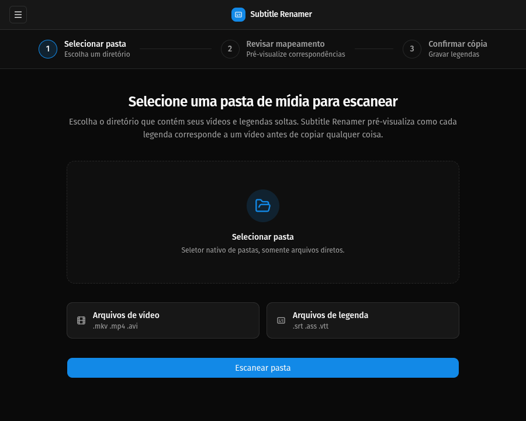
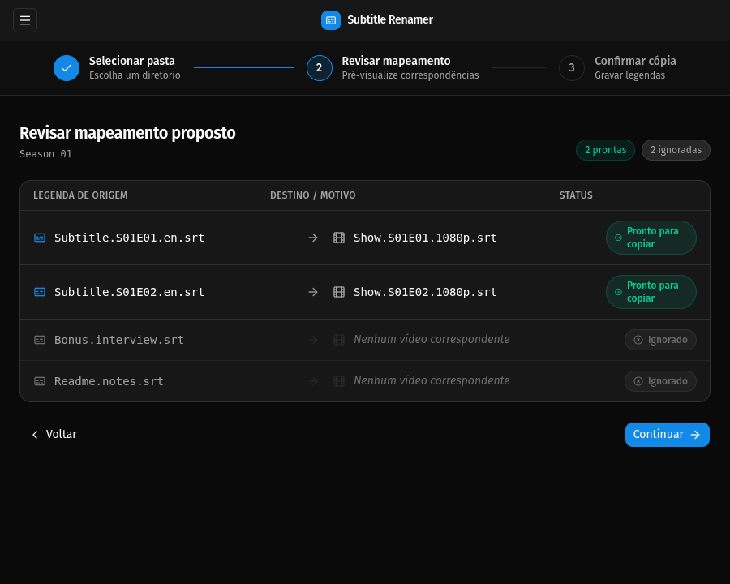

# Subtitle Renamer

Copie arquivos de legenda para nomes correspondentes aos vídeos sem renomear, mover ou excluir os originais.

[](https://github.com/leandrolid/subtitle-renamer/actions/workflows/ci.yml)
[](https://github.com/leandrolid/subtitle-renamer/releases/latest)
[](LICENSE)

[English](README.md)

## Por Que Usar O Subtitle Renamer?

Reprodutores de mídia geralmente encontram legendas quando os nomes da legenda e do vídeo são iguais. O Subtitle Renamer identifica episódios, mostra uma prévia das cópias seguras e cria nomes correspondentes sem alterar os arquivos de origem.

```text
Serie.S01E02.1080p.mkv
Legenda.S01E02.pt-BR.srt

se torna

Serie.S01E02.1080p.mkv
Serie.S01E02.1080p.srt       <- nova cópia
Legenda.S01E02.pt-BR.srt     <- original preservado
```

## Recursos

- Interfaces de linha de comando e desktop
- Prévia e confirmação antes da cópia
- Nenhuma sobrescrita, movimentação, renomeação ou exclusão
- Tratamento determinístico de correspondências ambíguas e duplicadas
- Identificação por `episode N`, `ep N`, `S01E02`, `1x02` e números estritos no fim do nome
- Pacotes nativos para Linux e Windows

## Aplicativo Desktop

<table>
  <tr>
    <td width="50%">
      <a href=".github/assets/desktop-choose-folder.png"></a>
    </td>
    <td width="50%">
      <a href=".github/assets/desktop-review-plan.png"></a>
    </td>
  </tr>
  <tr>
    <td align="center"><strong>Escolha uma pasta</strong><br />Selecione um diretório com vídeos e arquivos de legenda.</td>
    <td align="center"><strong>Revise cada correspondência</strong><br />Confira as cópias planejadas e legendas ignoradas antes de confirmar.</td>
  </tr>
</table>

## Instalação

Baixe o pacote mais recente para sua plataforma em [GitHub Releases](https://github.com/leandrolid/subtitle-renamer/releases/latest).

| Plataforma | Desktop | CLI |
| --- | --- | --- |
| Windows x86_64 | Instalador NSIS (`*-windows-x86_64-nsis.exe`) | Executável (`*-windows-x86_64.exe`) |
| Linux x86_64 | Pacote Debian (`*.deb`) ou AppImage (`*.AppImage`) | Executável (`*-linux-x86_64`) |

Os arquivos de versão não são assinados. Confira os downloads com o arquivo `checksums.txt` antes de executá-los:

```bash
sha256sum -c checksums.txt
```

No Linux, torne a CLI ou o AppImage executável primeiro:

```bash
chmod +x subtitle-renamer-*-linux-x86_64*
```

### Compilação A Partir Do Código-Fonte

[Instale o Rust](https://www.rust-lang.org/tools/install), clone o repositório e instale a CLI:

```bash
git clone https://github.com/leandrolid/subtitle-renamer.git
cd subtitle-renamer
cargo install --path crates/cli --locked
```

A compilação do aplicativo desktop também exige Node.js 24 e as [dependências de sistema do Tauri](https://v2.tauri.app/start/prerequisites/) para sua plataforma. Consulte [Contribuindo](CONTRIBUTING.md#desktop-development) para os comandos de desenvolvimento.

## Uso Da CLI

Execute com um diretório ou omita-o para verificar o diretório atual:

```bash
subtitle-renamer /caminho/para/episodios
subtitle-renamer
```

A busca não é recursiva e considera somente os arquivos diretamente no diretório. A CLI mostra cada cópia e cada item ignorado, então pede uma confirmação. Somente `y` ou `yes`, sem diferenciar maiúsculas e minúsculas, inicia a operação.

```text
COPY: "Legenda.S01E02.pt-BR.srt" -> "Serie.S01E02.1080p.srt"

Copy 1 file(s)? [y/N]
```

Execute `subtitle-renamer --help` para ver o resumo completo das regras de correspondência.

## Arquivos Suportados

| Tipo | Extensões |
| --- | --- |
| Vídeo | `mkv`, `mp4`, `avi`, `mov`, `m4v`, `webm` |
| Legenda | `ass`, `ssa`, `srt`, `vtt` |

Extensões não suportadas são ignoradas. O destino usa o nome-base do vídeo e a extensão da legenda de origem:

```text
<nome-base do vídeo>.<extensão da legenda>
```

## Garantias De Segurança

- As legendas de origem sempre permanecem no lugar.
- Arquivos de destino existentes nunca são sobrescritos.
- Correspondências ambíguas e destinos duplicados são ignorados em vez de escolhidos por tentativa.
- Todo plano não vazio é exibido antes do início das cópias.
- A primeira falha interrompe o lote e informa os itens concluídos, com falha e pendentes.

Motivos comuns para ignorar uma legenda incluem ausência de vídeo correspondente, correspondência ambígua sem temporada, múltiplos identificadores no nome, destino existente e várias legendas disputando o mesmo destino.

## Contribuindo

Relatórios de bugs e pull requests focados são bem-vindos. Leia [CONTRIBUTING.md](CONTRIBUTING.md) para instruções de ambiente, limites da arquitetura e verificações de qualidade. Siga também o [Código de Conduta](CODE_OF_CONDUCT.md).

Relate vulnerabilidades de segurança de forma privada conforme o [SECURITY.md](SECURITY.md).

## Licença

Distribuído sob a [Licença MIT](LICENSE).
